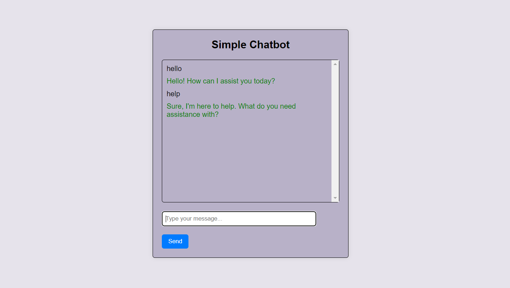

# ChatBot-Flask-Simple
🤖 Welcome to ChatBot-Flask! I'm a simple pre-response chatbot powered by Flask. Rather than generating responses on-the-fly using AI, I've been pre-programmed with a set of predefined responses to common queries. I'm here to provide quick and accurate information without the need for complex natural language processing. Have a question? Just ask, and I'll do my best to provide you with the information you need! Let's get chatting! 💬

🌐 Framework: Flask

💬 Functionality: Pre-response chatbot

🚀 Purpose: Providing quick and accurate information

💻 Tech Stack: Python, Flask

